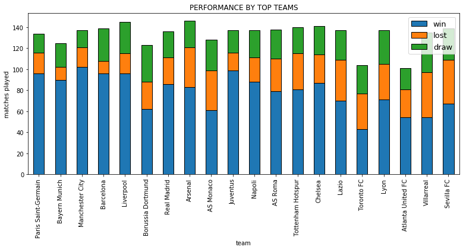
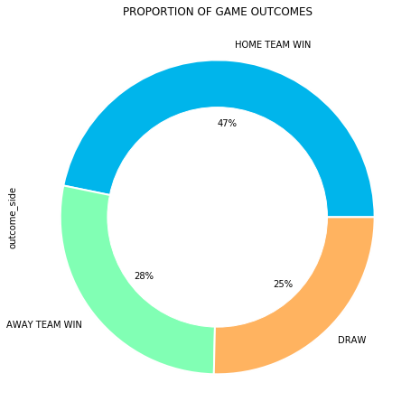
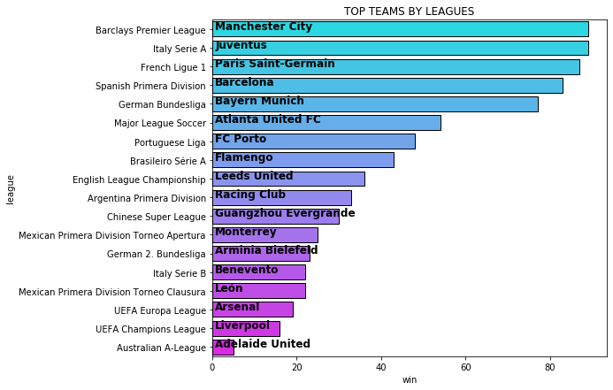
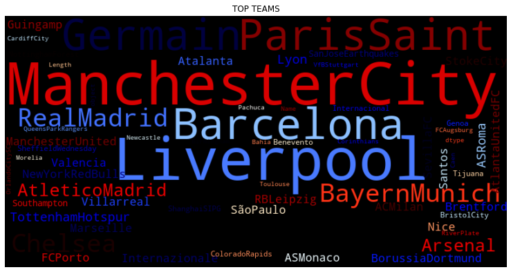

The Oscars
==============================

Data Visualization Project

## Introduction:
The project is about building vizualizations. The dataset picked was the soccer matches dataset which contains europe soccer matches and scores for multiple years. The project is about building data visualisation on scores, teams and matches for the soccer datasets. Exploratory data analysis is also performed on the data set to produce interesting results

The data was obatined from the following link:

https://github.com/fivethirtyeight/data/tree/master/soccer-spi

The data are contained in the files spi_global_rankings.csv, spi_global_rankings_intl.csv, spi_matches.csv.

## Approach:

#### Feature Engineering
* We created three additional features.
    * The first feature is called win that specified which of the two teams won the match. The value of this column is either "team1" or "team2" or "draw".
    * The second feature is called lost that specifies which of the two teams lost the match. The value of this column is either "team1" or "team2" or "draw".
   * The third feature is called outcome side that specifies whether the home or away team won the match. The value for this column is either "Home team won", "Away team won" or "Draw".

### Story Telling

The following graphs were plotted. They give you different views of the data.
1. count of matches by league
2. count of home and away goals by league
3. top 25 teams by their home goals
4. top 25 teams by their away goals
5. teams with the most goals
6. Distribution of home and away goals
7. Proportion of game outcomes based on home and away teams
8. Top Winning & Losing Teams
9. Performance by top teams
10. Top teams by league
11. Matches played in each league vs total goals scored
12. Proportion of matches played and goals scored in leagues
13. Top teams world cloud

#### Performance by top teams

#### Proportion of game outcomes

#### Top Teams by league

#### World Cloud

## Discussion:
Different visualizations were obtained for the dataset. Each visualization gives you a different view on the data. This visualizations are very helpful in data science projects because they allow you to get different perspectives about the data.

